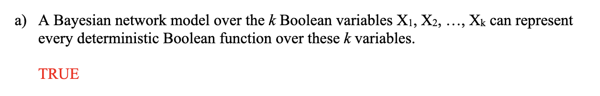
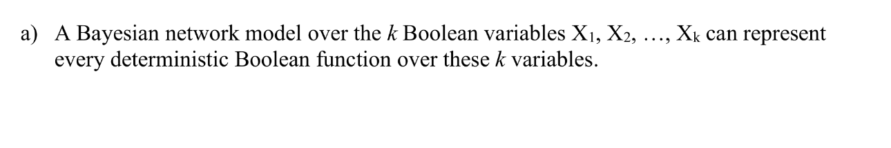

# Exercise sheet solution remover
Sometimes, instead of providing a separate solution sheet, the solutions are provided in the same PDF file as the questions, 
highlighted in red.
This script helps to remove the solutions from the PDF file.

It converts the PDF file to images, then removes all red pixels (the solutions), and then converts the images back to PDF.

## Example:
Before running:

After running:


## Installation
```bash
pip install -r requirements.txt
```

## Usage
```bash
python solution_remover.py -i <input_pdf>
```